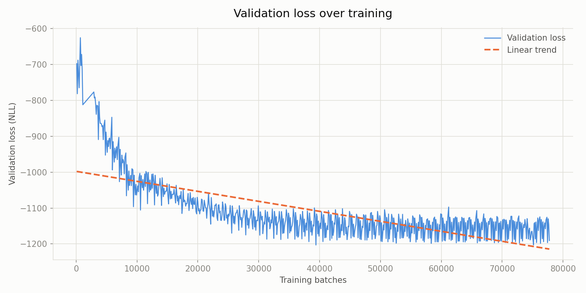

# WIP
## About
This project trains a model that could generate human-like handwriting given an input text.

## Dataset
This project uses the IAM On-Line Handwriting Database (IAM-OnDB), which must be downloaded separatley after registering on the FKI website.

Liwicki, M. and Bunke, H.: IAM-OnDB - an On-Line English Sentence Database Acquired from Handwritten Text on a Whiteboard. 8th Intl. Conf. on Document Analysis and Recognition, 2005, Volume 2, pp. 956 - 961

The database must be placed in a folder called Dataset, and the stroke sequences in Dataset/Strokes/lineStrokes

## Setup
Requires Python 3.13.
```
py -3.13 -m venv venv
```
Activate (pick the one for your shell):
```
venv\Scripts\activate          # cmd.exe
venv\Scripts\Activate.ps1      # PowerShell
source venv/Scripts/activate   # Git Bash -- must be "sourced", not run directly
```
Then install dependencies:
```
pip install -r requirements.txt
```

## Run
Activate the venv (see above), then:
```
python Training.py
```

Generate handwriting from text with a trained checkpoint:
```
python Testing.py "text to write"
```

## Results
Training progress, epoch 0 to 67 (sampled every epoch at batch 100):


Validation loss over training, with a linear trend line:

